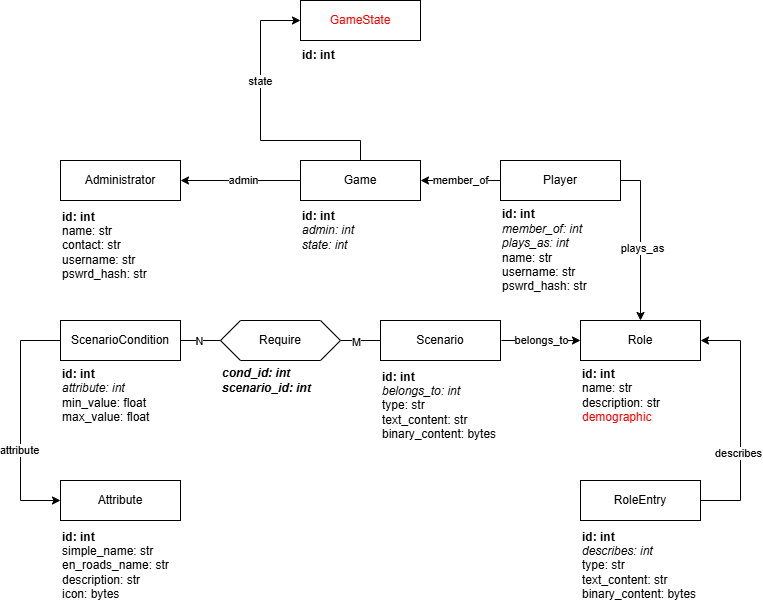

# Planspiel "Arbeitstitel"
In diesem Repository wird der gesamte Tech-Stacks des *planspiel* implementiert und dokumentiert. Das beinhaltet:
+ [Digitalisierte Definitionen der Prototyp-Rolen](#digitized)
+ [Daten-Modell](#daten-modell)
+ [Backend-Werkzeuge](#backend-setup)
+ [Middleware-Dienste](#middleware-dienste)
+ [Frontware-Dienste und Web-Applikation](#frontware-und-web-applikation)


## Definition von Prototyp-Rollen
> **WICHTIG FÜR ALLE, DIE SICH ROLLEN AUSDENKEN.**

Dieser Abschnitt erklärt das Vorgehen, um eine erdachte Rolle digital festzuhalten, so dass sie automatisiert in die Datenbank integriert werden kann. [Hier](#daten-modell) wird beschrieben, wie sie dann *innerhalb* der Datenbank repräsentiert und verwaltet wird.

### Max Mustermann
Für ein konzeptuelles Beispiel befindet sich im Ordner `prototype_roles/` die Rolle des "Max Mustermann". Die Rolle kann gerne kopiert und als Ausgangspunkt für eigene Rollen gewählt werden.

### Rolle erstellen
Um eine Rolle zu erstellen, muss zunächst ein *Name zur digitalen Identifikation* gewählt werden. Dabei bietet sich der **kleingeschriebene Name** mit **Unterstrichen** an. Aus "Max Mustermann" wird so zum Beispiel: `max_mustermann`.

Nun reicht es eine JSON-Datei mit dem entsprechenden Namen im Ordner `prototype_roles/` zu erstellen. Für "Max Mustermann" wäre das also die Datei `prototype_roles/max_mustermann.json`. Der Inhalt dieser Datei muss immer die folgende Form haben:
```json
// Inhalt von prototype_roles/<meine_rolle>.json:
// --------------------------------------------
{
    "name": "<Echter Name der Rolle>",
    "description": "<Kurze Beschreibung der Rolle>",
    "demographic": {},
    "entries": [],
    "scenarios": []
}
```

Die Attribute und Werte werden im Folgenden erklärt.

#### name
Hier wird **in Anführungszeichen** der echte Name der Rolle festgehalten, also zum Beispiel `"Max Mustermann"`.

#### description
Hier wird kurz die Rolle beschrieben. Das ist nicht sichtbar für den Schüler, sondern interessant für Leute, die die Rolle weiter ausarbeiten, oder die Absicht hinter der Rolle verstehen wollen.

#### demographic
Optionale Metadaten, die für ein faires Los-Verfahren genutzt werden können (**TODO**). Hier kann erstmal einfach `{}` stehengelassen werden.

#### entries
Eine komma-getrennte Liste an Rolleneinträgen. Deren Format wird [hier]() beschrieben.

#### scenarios
Eine komma-getrennte Liste an Szenario-Verweisen. Die Erstellung und Referenzierung von Szenarien wird [hier]() beschrieben.

### Rolle sichtbar machen
Eine wie zuvor definierte Rolle wird noch nicht automatisch in die Datenbank integriert - damit nicht aus Versehen unfertige Rollen hochgeladen werden. Sobald die Definition vervollständigt wurde (inklusive aller [Einträge]() und [Szenarien]()) muss sie *sichtbar* gemacht werden. Dafür muss einfach der digitalisierte Name am das Ende der Datei `prototype_roles/role_names.txt` angefügt werden:
```text
Inhalt von prototype_roles/role_names.txt:
-----------------------------------------------
...
max_mustermann
...
<meine_rolle>
```
Sobald dieser Schritt abgeschlossen wurde kann die Rolle mithilfe des `setup_prototype_roles.py`-Skripts zu einer verfügbaren Datenbank hinzugefügt werden (siehe [hier]()).

### Rolleneinträge hinzufügen
Eine Rolle lebt von den Informationsschnippseln, die ein Schüler zur Verfügung hat. Jeder dieser Schnipsel wird durch einen einzelnen Rolleneintrag definiert. 
> Rolleneinträge sind gerade die Informationsschnippsel, die nicht an Szenarien geknüpft sind, sondern dem Schüler **von Anfang an** zur Verfügung stehen.  

Ein Rolleneintrag wird mithilfe des `entries`-Attribut in die Rollendefinition eingefügt:
```json
// Inhalt von prototype_roles/<meine_rolle>.json:
// --------------------------------------------
{
// ...
  "entries": [
    {
      "type": "<mein_eintrags_typ>",
      "text_content": "<meine_text_ressource>" | null,
      "binary_content": "<meine_bild_ressource>" | null
    }
  ]
// ...
}
```
> Genau genommen ist das `entries`-Attribut eine Liste, im Beispiel `max_mustermann.json` sieht man, wie mehrere Rolleneinträge definiert werden.

Ein Rolleneintrag besitzt also wieder mehrere Attribute, mit folgender Bedeutung.

#### type
Legt den Typ des Rolleneintrags fest. Das ist insbesondere wichtig, damit die grafische Anzeige weiß, wie der Informationsschnippsel präsentiert werden soll. Hier kann aus folgenden Werten ausgewählt werden:
+ `"info"`: In der `text_content`-Ressource befindet sich ein Steckbrief der Rolle.
+ `"diary"`: In der `text_content`-Ressource befindet sich ein Tagebucheintrag der Rolle.
+ `"article"`: In der `text_content`-Ressource befindet sich ein Zeitungsartikel, der die Rolle betrifft.
+ `"picture"`: In der `binary_content`-Ressource befindet sich ein Bild, das die Rolle betrifft.
+ **TODO**

#### text_content
Enthält einen Verweis auf eine Text-Ressource (z.B. eine .txt-Datei) **in Anführungszeichen**, oder besitzt den Wert `null`, falls der Typ des Rolleneintrags keinen Text benötigt. Ressourcen werden [hier]() erklärt.

#### binary_content
Enthält einen Verweis auf eine Binär-Ressource (z.B. eine Bilddatei) **in Anführungszeichen**, oder besitzt den Wert `null`, falls der Typ des Rolleneintrags keine Binärdaten benötigt. Ressourcen werden [hier]() erklärt.

> Das Max-Mustermann-Beispiel beinhaltet Beispiele für Rolleneinträge, die sowohl von `binary_content` als von `text_content` Gebrauch machen.

### Ressourcen hinzufügen
Ressourcen sind einzelne Dateien, die größere Inhalte abkapseln, damit die Rollendefinition in `prototype_roles/<meine_rolle>.json` nicht zu groß wird. Jede Datei, die im Ordner `prototype_roles/resources/` angelegt wird, wird automatisch als Ressource zur Verfügung gestellt und kann dann in den `text_content`- und `binary_content`-Feldern referenziert werden.

Möchte ich beispielsweise einen Rolleneintrag vom Typ `"picture"`, also ein Bild, zu einer Rolle hinzufügen, muss ich zunächst die Bilddatei in den `prototype_roles/resources/`-Ordner ziehen. Dort gebe ich ihr dann einen passenden Namen, zum Beispiel: `<meine_rolle>_picture.png`. Zuletzt muss ich noch die Felder des Eintrags anpassen:
```json
// ...
{
  "type": "picture",
  "text_content": null,
  "binary_content": "<meine_rolle>_picture.png"
}
// ...
```

Da sich das Bild mit dem entsprechenden Namen im Ressourcen-Ordner befindet, wird es automatisch dem Rolleneintrag zugeordnet.

> Für Text-Ressourcen funktionert das Vorgehen analog, nur dass `binary_content` auf `null` gesetzt wird und eine Text-Datei (z.B. `<meine_rolle>_diary.txt`) referenziert wird.

### Szenarien hinzufügen
**TODO**

## Daten-Modell

### Scheme der relationalen Datenbank


## Backend Setup

## Middleware-Dienste

## Frontware und Web-Applikation